  

  
  
  

---

### `> whoami`

Solo security researcher. I run **Kairos Lab Security Research** — Web3 smart contract audits, Web2 bug bounty, and the tooling that makes both faster.

I build the infrastructure I wish the ecosystem already had, then keep it running.

**Focus** — economic and cross-contract invariants · Uniswap v4 hooks · bridges and proxies · modern-web exploitation chains (postMessage/XSS, broken access control, SSRF, business logic).

---

### `> ls ./shipped`

| | Project | What it is |
|---|---|---|
| ⛓ | **[AsterScan](https://aster-scan.com)** | Community block explorer for Aster Chain. Live, growing DAU, v2 chart engine. |
| 🛡 | **Kairos Recon** | Dual-spectrum passive recon SaaS. Amber phosphor design system. |
| 🔑 | **KairosAuth** | Passwordless auth — WebAuthn + ZK proofs. Base Sepolia → Aster Chain. |
| 🔬 | **[StatShield](https://github.com/Valisthea/Statshield-website)** | Scientific integrity scanner. 8 analysis modules, GRIM/SPRITE/statcheck, image forensics. |
| 📜 | **Covenant** | Declarative smart contract language with native FHE, ZK and post-quantum primitives. |

---

### `> cat ./arsenal`

**Web3**
`Solidity` `Foundry` `Slither` `Aderyn` `Mythril` `Halmos` `Echidna` `EVM internals`

**Web2**
`Burp Suite` `Nuclei` `Semgrep` `ffuf` `mitmproxy` `SQLMap` `OWASP / PTES / NIST`

**Build**
`TypeScript` `Python` `React` `Next.js` `Vite` `Godot` `WeasyPrint`

---

### `> tail -f ./research`

- **Cantina — Morpho Midnight** audit competition. Findings documented, full report shipped.
- **Intigriti — Capture Our Flag.** ~200h on a hardened Duende IdentityServer + BFF + Angular stack. Deep architectural intelligence, one collateral High severity finding, and an honest map of every dead end.
- Ongoing: measuring exploit-confirmation rates per vulnerability class against **EVMbench**, because a methodology you haven't benchmarked is a story you tell yourself.

---

### `> ./contributions --replay`

  <picture>
    <source media="(prefers-color-scheme: dark)" srcset="https://raw.githubusercontent.com/Valisthea/Valisthea/output/kairos-snake-dark.svg">
    <source media="(prefers-color-scheme: light)" srcset="https://raw.githubusercontent.com/Valisthea/Valisthea/output/kairos-snake.svg">
    
  </picture>

---

### `> contact`

Audits, bug bounty engagements, or Aster ecosystem work → **[kairos-lab.org](https://kairos-lab.org)** · **[@Valisthea](https://x.com/Valisthea)**

  <code>the blade is sharpened in private, tested in public.</code>

